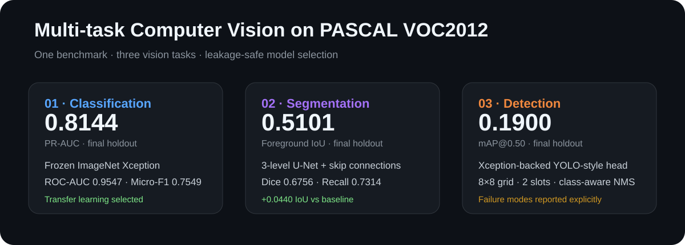
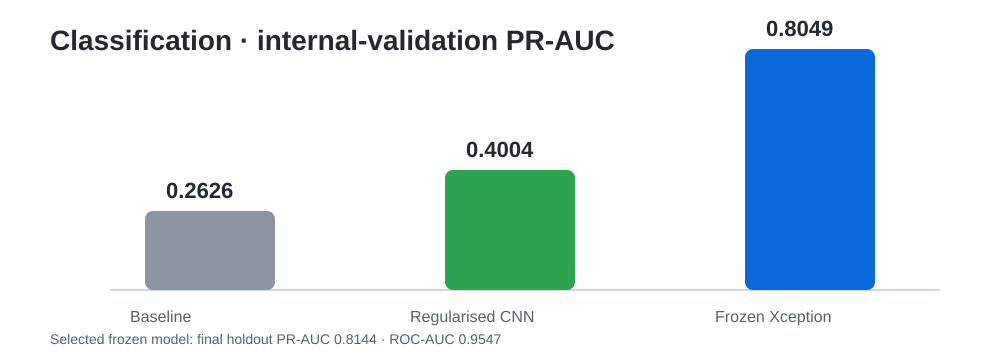
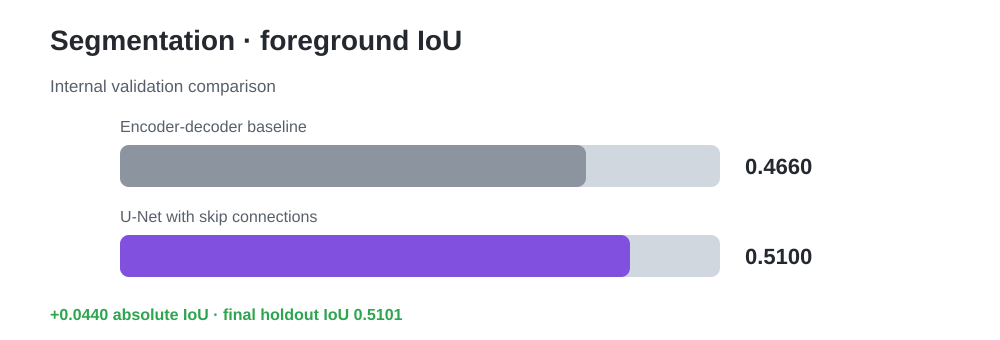
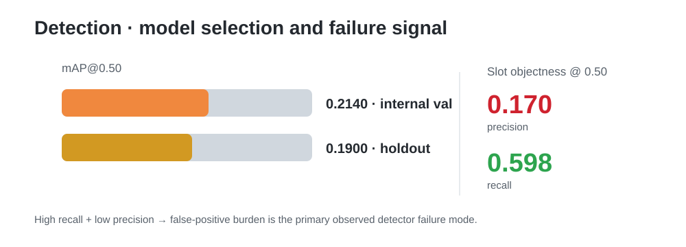

# Multi-task Computer Vision on PASCAL VOC2012

End-to-end deep learning experiments for **multi-label image classification**, **binary semantic segmentation**, and **20-class object detection** on PASCAL VOC2012 using TensorFlow/Keras.

Developed as an MSc Artificial Neural Networks & Deep Learning project, this repository emphasizes not only model performance but also **controlled experimentation, leakage-safe model selection, reproducibility, and failure analysis**.



## Headline results

| Task | Selected model | Final holdout result |
|---|---|---:|
| Multi-label classification | Frozen ImageNet Xception + bottleneck head | **PR-AUC 0.8144 · ROC-AUC 0.9547 · Micro-F1 0.7549** |
| Binary semantic segmentation | 3-level U-Net with skip connections | **Foreground IoU 0.5101 · Dice 0.6756** |
| Object detection | Xception-backed two-slot YOLO-style detector | **mAP@0.50 0.1900** |

> **Evaluation discipline:** architecture, checkpoint, threshold, and post-processing decisions were made using training + internal-validation data only. The official VOC validation partitions were retained as one-time final holdouts.

## Why this project is useful

The project demonstrates three different levels of visual understanding on one benchmark:

- **Classification:** what objects are present in an image?
- **Segmentation:** which pixels belong to foreground objects?
- **Detection:** what objects are present, and where are they located?

The experiments also include negative results. Residual shortcuts did not improve the selected scratch classifier, restricted Xception fine-tuning did not outperform the frozen checkpoint, and the custom detector remained limited by false positives and coarse localisation. Those outcomes are kept because they reveal the actual model-selection process rather than presenting only winning runs.

## 1. Multi-label classification

Three CNNs were trained from scratch before transfer learning was introduced:

1. **High-capacity baseline** - intentionally over-parameterised to expose overfitting.
2. **Regularised efficient CNN** - augmentation, L2, batch normalisation, dropout, global average pooling, and depthwise-separable convolutions.
3. **Residual separable CNN** - tested whether residual shortcuts improved the regularised design.

The regularised CNN reduced parameters from **16.26M to 0.68M (95.8% fewer)** while improving validation BCE from **0.22095 to 0.18454** and PR-AUC from **0.26261 to 0.40043**.

Transfer learning then produced the strongest classification model. A frozen ImageNet-pretrained Xception backbone with a compact bottleneck head achieved the final holdout results shown below.



Fine-tuning the final Xception block increased trainable capacity without improving the predeclared selection metric, so the simpler frozen model was retained.

## 2. Binary semantic segmentation

All 20 VOC object classes were merged into one foreground channel. Background remained class 0, while VOC void pixels (255) received zero weight in both loss and evaluation.

A baseline encoder-decoder was compared with a parameter-matched U-Net. Skip connections improved internal-validation foreground IoU from **0.46599 to 0.51003**. The selected U-Net then reached **0.51007 IoU** and **0.67556 Dice** on the untouched holdout.



The per-image results show substantial heterogeneity: large objects are generally captured well, while thin structures, boundaries, and nearby foreground regions remain difficult at 128×128 resolution.

## 3. Object detection

The detector uses:

- ImageNet-pretrained **Xception** backbone
- **8×8** spatial grid
- **2 object slots per grid cell**
- custom objectness + localisation + class loss
- inverse-frequency class weighting
- VOC-compatible handling of **difficult** objects
- class-aware non-maximum suppression

The best model was selected directly by internal-validation **mAP@0.50**, not by the composite training loss. The frozen-backbone checkpoint peaked at **0.21395 mAP@0.50**; restricted fine-tuning did not surpass it. Final holdout mAP@0.50 was **0.19000**.



Objectness recall was much higher than precision, indicating a high false-positive burden. The main limitations were the coarse grid, small-object localisation, crowded scenes, and the limited detector head rather than the Xception feature extractor alone.

## Experimental protocol

| Task | Training | Internal validation | Final holdout |
|---|---:|---:|---:|
| Classification | 4,574 | 1,143 | 5,823 |
| Segmentation | 1,171 | 293 | 1,449 |
| Detection | 4,574 | 1,143 | 5,823 |

Key safeguards:

- deterministic seed (`42`) and TensorFlow deterministic operations
- zero ID overlap between development and holdout partitions
- class-prevalence auditing before model training
- task-specific checkpoint selection on internal validation only
- fixed 0.50 classification/segmentation threshold before holdout evaluation
- fixed detection NMS IoU of 0.50 and AP IoU of 0.50
- VOC void and difficult annotations handled explicitly

## Repository structure

```text
.
├── README.md
├── requirements.txt
├── pyproject.toml
├── notebooks/
│   └── project_walkthrough.ipynb
├── src/
│   └── voc_multitask/
│       ├── __init__.py
│       ├── metrics.py
│       └── models.py
├── assets/
│   ├── project_overview.svg
│   ├── classification_progress.svg
│   ├── segmentation_progress.svg
│   └── detection_summary.svg
├── docs/
│   └── technical_report.md
├── tests/
│   └── test_metrics.py
└── .github/workflows/
    └── quality.yml
```

## Reproducing the notebook

### 1. Clone and create an environment

```bash
git clone https://github.com/Tanjim-hossain/pascal-voc2012-multitask-vision.git
cd pascal-voc2012-multitask-vision
python -m venv .venv
source .venv/bin/activate   # Windows: .venv\Scripts\activate
pip install -r requirements.txt
```

### 2. Download PASCAL VOC2012

Download and extract the official VOC2012 train/validation archive so that the directory contains:

```text
VOCdevkit/VOC2012/
├── Annotations/
├── ImageSets/
├── JPEGImages/
└── SegmentationClass/
```

Then either place `VOCdevkit/` in the repository root or set:

```bash
export VOC_ROOT=/absolute/path/to/VOCdevkit/VOC2012
```

The notebook also detects VOC2012 automatically when run inside Kaggle.

### 3. Launch the notebook

```bash
jupyter notebook notebooks/project_walkthrough.ipynb
```

Full retraining is GPU-intensive. The original experiments were executed on Kaggle with **two NVIDIA Tesla T4 GPUs**, TensorFlow **2.20.0**, Keras **3.13.2**, and Python **3.12.13**.

## Technical stack

**Python · TensorFlow · Keras · NumPy · pandas · scikit-learn · Matplotlib · PIL · CNNs · Xception · transfer learning · U-Net · YOLO-style detection**

## Limitations and next steps

- quantify variability across multiple random seeds rather than one deterministic split
- explore class-specific classification thresholds using internal validation only
- increase segmentation resolution and use overlap/boundary-aware losses
- replace the coarse detection grid with a multi-scale feature pyramid or anchor-free head
- add geometric box augmentation and focal-style objectness loss for detection
- calibrate detector proposal scores while retaining the locked-holdout protocol

## Technical report

A recruiter-friendly methodology and results record is available in [`docs/technical_report.md`](docs/technical_report.md). The notebook contains the full preprocessing, model definitions, training/evaluation logic, and preserved experimental protocol.

## Author

**Tanjim Hossain**  
MSc Statistics & Data Science - Data Science track, Hasselt University
